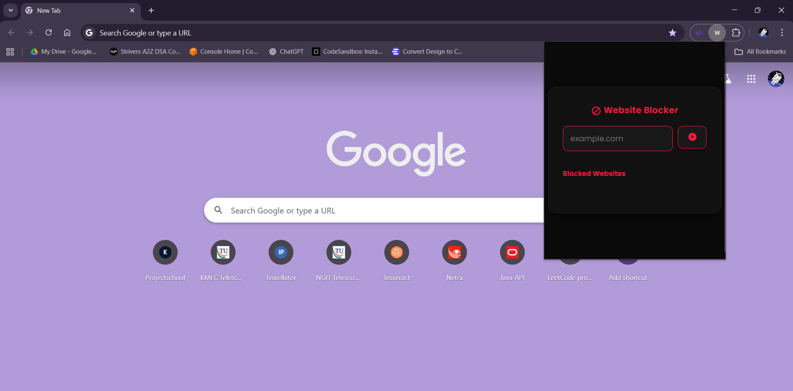

# 🚫 Website Blocker Chrome Extension

A simple Chrome Extension that allows users to block and unblock websites dynamically through a user-friendly popup UI.

## ✨ Features
- Block websites by entering their domain (e.g., `facebook.com`)
- View a list of currently blocked sites
- Unblock any site with one click
- Rules are enforced at Chrome’s network level using Declarative Net Request API

## 🛠️ Technologies Used
- JavaScript (ES6)
- HTML5 & CSS3
- Chrome Extensions (Manifest V3)
- Chrome Declarative Net Request API
- Chrome Storage API

## 📸 Screenshots



## 🚀 How to Install
1. Clone this repo
   ```bash
   git clone https://github.com/Avaneesh-23/website-blocker-extension.git

2. Open Chrome → chrome://extensions/

3. Enable Developer mode

4. Click Load unpacked and select the project folder

5. Done! 🎉
